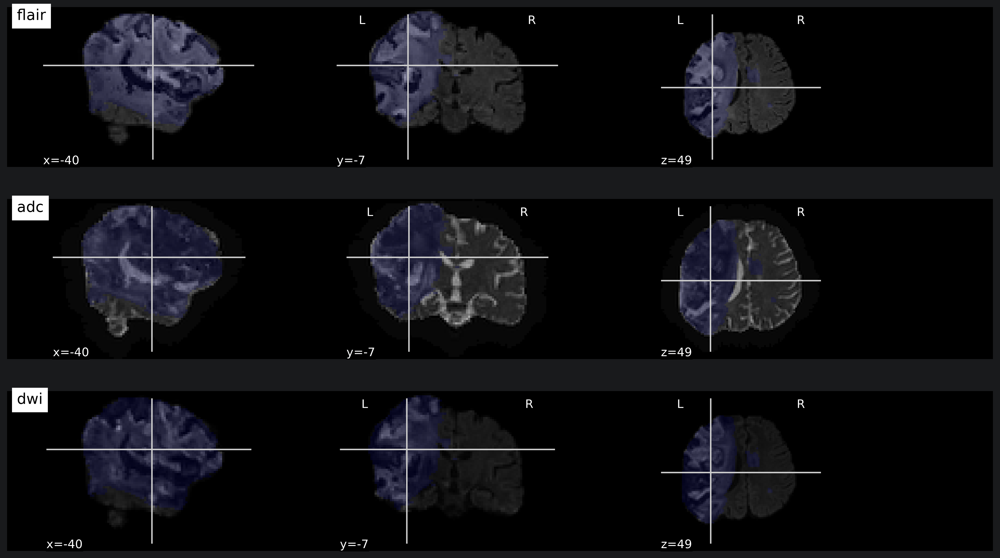
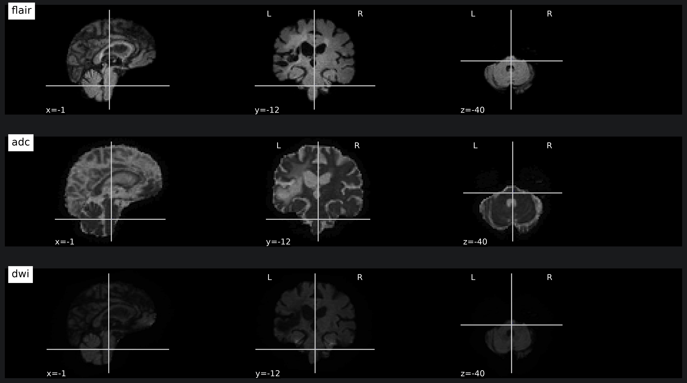

# Сегментация очагов ишемического поражения на МР-снимка мозга

Репозиторий содержит проект, посвященный задаче сегментации очагов ишемического поражения
на МР-снимках головного мозга. В проекте реализовано сравнение четырех моделей сегментации объектов.

Основная цель проекта — оценить, насколько различные модели сегментации объектов способны 
сегментировать очаги ишемического инсульта разного объема и количества на острой и подострой 
стадии, и разработать модель, показывающую высокое качество сегментации.

### Мотивация к реализации

Во время обучения в бакалавриате и магистратуре я занимался МР-визуализацией ишемического 
инсульта. Значительная часть работы заключалась в ручной сегментации ишемических поражений,
что является достаточно монотонной и скучной работой. Поэтому я решил реализовать модель, 
которая смогла бы с высоким качеством сегментировать очаги ишемического поражения и была
бы очень полезна в прошлом.

### Актуальность проекта

С увеличением скорости МР-диагностики, растет доля назначений МР-визуализации ишемического 
поражения на ранних стадиях инсульта, в том числе и для первичной диагностики [1, 2], в том 
числе по причине большей информативности МР-снимков, по сравнению с КТ, которая позволяет 
врачам лучше планировать лечение [3]. По этой причине все большую актуальность набирают
методы автоматической сегментации ишемического поражения на ранних сроках, которые позволили
бы врачам быстрее анализировать МР-снимки.

---

##  Стек технологий

* **Язык**: Python 3.10+
* **Глубокое обучение**: PyTorch, MONAI.networks
* **Трансформация и аугментация данных**: MONAI.transforms
* **Регистрация изображений**: SimpleITK
* **Валидация и метрики**: SciPy, MedPy, MONAI.losses
* **Инструменты и анализ**: NiBabel, Pandas, NumPy, Scikit-learn
* **Визуализация**: Nilearn, Matplotlib, Seaborn

---

## Структура репозитория

```text
├── src/                            # Исходный код проекта (Модули)
│   ├── data_utils.py               # Функции загрузки данных, выделения групп пациентов
│   ├── image_analysis.py           # Функции анализа метаданных и интенсивности изображений  
│   ├── lesion_analysis.py          # Функции анализа масок исходной сегментации
│   ├── visualization.py            # Функции визуализации МР-изображений с наложением масок 
│   ├── preprocessing.py            # Разбиение на подвыборки, трансформация и аугментация данных, формирование лоадеров
│   ├── get_model.py                # Инициализации моделей (U-Net, Attention U-Net, U-Net ++, Swin UNETR)
│   ├── train_model.py              # Функция обучения и валидации модели
│   └── evaluate_model.py           # Функции поиска оптимального порога уверенности и расчета метрик 
├── weights/                        # Директория для сохранения весов моделей
├── visual_reports/                 # Директория для сохранения изображений для отчета
├── .gitignore                      # Исключение тяжелых весов и датасета из контроля версий
├── EDA.ipynb                       # Ноутбук с анализом изображений и масок сегментации
├── register_flair.ipynb            # Ноутбук с регистрацией FLAIR снимков к DWI
├── model_exploration.ipynb         # Ноутбук c обучением всех моделей с сохранением лучших весов
├── final_model.ipynb               # Ноутбук c доработкой итоговой модели
├── DATA_LICENSE.txt                # Текстовый документ с информацией о лицензии на данные
├── requirements.txt                # Список зависимостей для развертывания проекта
└── README.md                       # Документация проекта
```

---
## Источник данных и лицензия

В работе используется датасет ISLES 2022, содержащий МР-изображения головного мозга и маски сегментации 
ишемического поражения. Среди МР-изображений представлены протоколы: FLAIR, DWI, ADC

Датасет распространяется под лицензией **MIT License**. 

* **Оригинальный репозиторий датасета**: [ISLES 2022](https://zenodo.org/records/7960856)
* **Авторы датасета**: Hernandez Petzsche, de la Rosa, Ezequiel, et al. Полные ссылки на 
авторство указаны в источниках [4, 5, 6].
* **Условия использования**: Разрешается использование данных в коммерческих и некоммерческих целях 
при условии указания авторства и без права распространения самих данных без письменного согласия авторов. 
Соответствующий файл лицензии сохранен в корне проекта.

---

## Использованное оборудование

* GPU: NVIDIA GeForce RTX 4050
* RAM: 16 GB
* Память: 6 GB (с учетом данных, установки библиотек и весов моделей)

##  Установка и запуск

1. Клонируйте репозиторий:
   ```bash
   git clone https://github.com/vladschwartz99-cmd/portfolio.git
   ```
   
2. Перейдите в директорию проекта:
   ```bash
   cd portfolio/Stroke_segmentation
   ```
   
3. Установите зависимости:
   ```bash
   pip install -r requirements.txt
   ```
   
4. Организация окружения:
   ```bash
    pip install jupyter nbconvert ipykernel
    python -m ipykernel install --user --name recommender --display-name "Python (segmentation)"
   ```

5. Запустите ноутбуки:
   ```bash
   jupyter nbconvert --execute --inplace EDA.ipynb
   jupyter nbconvert --execute --inplace register_flair.ipynb
   jupyter nbconvert --execute --inplace model_exploration.ipynb # (модели тренируются около недели на RTX 4050)
   jupyter nbconvert --execute --inplace final_model.ipynb # (модели тренируются около 2 дней на RTX 4050)
   ```
   
---

## Исследовательский анализ данных (EDA)

Анализ МР-изображений и масок сегментации показал, что:
* В данном датасете представлены МР-изображения 247 пациентов с ишемическим инсультом и 3 пациентов без него. 
* Для каждого пациента имеются FLAIR, DWI и ADC снимки, а также маска сегментации ишемического поражения 
(для пациентов без инсульта - маски пустые). 
* МР-изображения различаются по размерам, объему вокселей, интенсивности, матрице преобразований и типу данных 
как внутри групп снимков, так и между группами. То же самое относится и к маскам сегментаций. 
* Ишемические поражения варьируются по объемам (от 0 до 500 см3) и количеству очагов (от 0 до 250), а данные 
о клинической ситуации такие, как локализации окклюзии сосудов у пациентов, факт реперфузии сосудов и 
временные метки МРТ-сканирования после начала ишемического эпизода отсутствуют.
* Локализация очагов поражения у пациентов также различна. Очаги встречаются в полушариях, в стволе головного мозга, 
либо в обоих этих отделах мозга.

Далее будут приведены примеры МР-снимков для визуального отражения разнообразия датасета

Пример крупного ишемического поражения, локализующегося в полушариях:
<p align="center">
  
</p>

Пример ишемического поражения небольшого объема, локализующегося в стволе мозга (он плохо визуализируется из-за 
небольших размеров; локализируется на пересечении осей):
<p align="center">
  
</p>

---

## Разбиение данных на подвыборки

Разбиение данных производилось со стратификацией по пациенту, количеству и размерам очагов поражения. 
Стратификация по пациентам была необходима в связи с тем, что для каждого пациента имеется по 3 МР-изображения
разных протоколов, и нельзя было допустить распространение снимков одного пациента по разным подвыборкам во 
избежание утечки данных. 

Для стратификации по количеству и размерам очагов, признак количества очагов был разделен на единый очаг и 
множественные очаги, а признак размера очагов был раздел на крупные и мелкие очаги по медиане объема очагов 
в данном датасете (а не по медицинской границе объема, так как из-за особенности датасета большинство очагов
классифицировались как мелкие). Эти признаки были объединены в единый признак, на основе которого пациенты 
разделились на 5 групп:

| Группа пациентов                      | Количество пациентов |
|:--------------------------------------|:--------------------:|
| Множественные очаги смешенного объема |         167          |
| Один крупный очаг                     |          42          |
| Множественные только крупные очаги    |          36          |
| Без поражения                         |          3           |
| Множественные только мелкие очаги     |          2           |

Пациенты разделены на группы по размеру и количеству очагов поражения неравномерно. Больше всего пациентов 
представлено в группе множественных очагов смешанного объема, составляя 67% от общего числа пациентов. 
Пациенты с одним очагом небольшого объема отсутствую, а пациенты с одним крупным очагом составляют 17% 
от общего числа пациентов. Учитывая, что порог разделения крупных и мелких очагов производился по медиане 
данного датасета, а не по клинической границе, это говорит о том, что данный датасет сильно смещен в 
сторону случаев инсульта эмболического генеза, так как, согласно статистике, случаи инсульта, 
представленные одним очагом составляют 45-50% от всех случаев инсульта [7]. Также в датасете представлено 
3 пациента без ишемического поражения.

---

## Предобработка изображений

Для всех изображений производились следующие трансформации:
* Приведение к единому пространственному положению.
* Приведение к единому объему вокселя.
* Удаление фона.
* Нормализация, с отсеиванием экстремальных значений для подавления шума.
* Объединение протоколов в одно многоканальное изображение.
* Патчинг изображения для тренировочных данных производился с повышенной репрезентацией очагов для борьбы с 
дисбалансом классов, а для валидационных и тестовых данных - равномерный по всему изображению с перекрытием 
* в 50%.

Для тренировочных данных также производились аугментации:
* Случайный поворот в пределах 15 градусов по всем осям
* Отражение по осям X, Y и Z. Так как при патчинге модель не сможет опираться на общую анатомию мозга, 
отражения по всем осям допустимы
* Добавление гаусового шума, для борьбы с переобучением
* Изменение контрастности, так как степень изменения интенсивности в очаге инсульта зависит от большого 
количества факторов и может быть разной у случаев инсульта схожего генеза

При формировании многоканального изображения было обнаружено, что FLAIR снимки накладываются на DWI и ADC
некорректно, на основании чего было обнаружено, что FLAIR снимки не регистрировались к остальным снимкам, 
что потребовало самостоятельной регистрации для формирования верного многоканального изображения при помощи
SimpleITK

---

## Исследуемые архитектуры моделей

Были выбраны четыре архитектуры сегментации изображений для определения наиболее 
эффективной для данной задачи:

1. **3D U-Net**: Используется, как базовая модель сегментации 3D изображений.
2. **3D Attention U-Net**: Ожидается более высокая точность на очагах малого объема, за счет механизма внимания.
3. **3D U-Net ++**: Ожидаются более высокие: соответствие границ сегментации и очага; точность на очагах малого 
объема за счет плотных вложенных связей.
4. **Swin UNETR**: Ожидается более высокая точность на очагах малого объема, а также интересно посмотреть, как 
с этой задачей справится трансформер.


## Наборы протоколов, выбранные для проведения экспериментов

* DWI + ADC

Так как ADC является производным от DWI и несет дополнительные, согласованные с DWI, признаки, то использование 
этих протоколов в совокупности, потенциально дает, обученной на них модели, лучшее качество в сравнении с 
моделями, обученными только на ADC или DWI.

* DWI + ADC + FLAIR

Обучение модели исключительно на FLAIR не представляется рациональным для сегментации очага инсульта на острой 
и подострой стадиях по причине того, что на FLAIR визуализируются зона пенумбры и очаги хронического инсульта. 
По этой причине данный протокол будет добавлен к ADC и DWI для оценки того, несет ли FLAIR дополнительные 
полезные признаки для данной задачи.

---

## Обучение моделей

Все модели обучались в течении 200 эпох, с механизмом ранней остановки на основе метрики soft Dice 
валидационной выборки.

В качестве функции потерь был выбран DiceFocalLoss за счет чувствительности к небольшим объектам на изображении.

В качестве оптимизатора был выбран AdanW, так как он лучше борется с переобучением, чем классический Adam.

В качестве планировщика скорости обучения был выбран ReduceLROnPlateau, отслеживая коэффициент Дайса на 
валидационной выборке.

Из-за нехватки вычислительных ресурсов для передаци моделям батча из более чем 2 изображений, был реализован
механизм градиентного накопления

---

## Методы оценки моделей

Для изображений подсчитывались глобальные метрики Recall, Precision, F1, Dice, IoU, HD, корреляция Спирмена
для объемов очагов. После чего, на основе метрики Dice выбирался оптимальный порог уверенности модели.

С выбранным порогом подсчитывались Dice, IoU, HD по группам пациентов для каждого очага инсульта по 
отдельности, после чего подсчитывались средние метрики по группам пациентов и очагам разных размеров

Проводилось визуальное сравнение исходной и предсказанной масок для случаев лучшей и худшей сегментации,
основываясь на метрике Dice для конкретного пациента

---

## Сравнение моделей и наборов протоколов для обучения:


| Набор протоколов  |       Модель       | Global_recall | Global_precision | Global_F1  | Global_dice | Big_lesion_dice | Small_lesion_dice |  Global_HD  | Global_spearman_coef |
|:------------------|:------------------:|:-------------:|:----------------:|:----------:|:-----------:|:---------------:|:-----------------:|:-----------:|:--------------------:|
| DWI + ADC         |      3D U-Net      |     0.81      |       0.78       |    0.79    |    0.59     |      0.56       |      0.0001       |    26.86    |         0.86         |
| DWI + ADC         | 3D Attention U-Net |     0.73      |       0.70       |    0.72    |    0.50     |      0.58       |       0.10        |    44.04    |         0.67         |
| DWI + ADC         |     3D U-Net++     |     0.88      |       0.85       |    0.87    |    0.64     |      0.64       |       0.17        |    32.62    |         0.86         |
| DWI + ADC         |     Swin UNETR     |     0.85      |       0.81       |    0.83    |    0.63     |      0.64       |       0.18        |    28.72    |         0.78         |
| DWI + ADC + FLAIR |      3D U-Net      |     0.85      |       0.88       |    0.86    |    0.61     |      0.56       |         0         | **_20.80_** |         0.94         |
| DWI + ADC + FLAIR | 3D Attention U-Net |     0.88      |       0.85       |    0.87    |    0.60     |      0.57       |    **_0.21_**     |    38.40    |         0.79         |
| DWI + ADC + FLAIR |     3D U-Net++     |  **_0.92_**   |    **_0.89_**    | **_0.90_** | **_0.67_**  |   **_0.67_**    |       0.15        |    29.96    |      **_0.95_**      |
| DWI + ADC + FLAIR |     Swin UNETR     |     0.85      |       0.81       |    0.83    |    0.59     |      0.63       |       0.16        |    37.86    |         0.95         |
_Примечание: В данной таблице значения метрик округлены до 2 знаков после запятой, но выделение лучших метрик
производилось на основании полных значений метрик_


Использование протокола FLAIR для обучения:
* для всех моделей улучшает способность обнаруживать ишемическое поражение, снижает генерацию ложных очагов, улучшает 
оценку объема поражения;
* для всех моделей, кроме Swin UNETR повышает качество общей сегментации всего поражения и крупных ишемических очагов, 
а также качество сегментации границ поражения;
* для всех моделей, кроме 3D Attention U-Net, снижает качество сегментации очагов малого объема.

Сравнение моделей:
* 3D U-Net показывает удовлетворительные метрики сегментации крупных очагов ишемического инсульта и наилучшее качество
сегментации границ поражения, однако также и неспособность производить сегментацию мелких очагов
* 3D Attention U-Net показывает худшее качество, по сравнению со всеми остальными моделями, по всем показателям, кроме
качества сегментации ишемических очагов малого объема, превосходя по этому показателю все остальные модели
* 3D U-Net++ показывает лучшие метрики полноты, точности, оценки объема поражения и качества общей сегментации и 
сегментации крупных ишемических очагов, показывая, что среди всех исследованных моделей, она лучше всего справляется 
с поставленной задачей
* Swin UNETR по общему качеству занимает второе место при обучении на DWI и ADC, и уступает другим моделям при 
добавлении протокола FLAIR. Вероятно, даже при условии использования предобученных весов и аугментации изображений, 
размер датасета оказался недостаточным для ее качественного обучения

Также производилось визуальное сравнение исходных и сгенерированных масок для лучших и худших случаев сегментации
каждой модели. Результаты этих сравнений согласуются с наблюдениями, полученными на основе метрик.

---

## Методы доработки выбранной модели

Основной задачей доработки модели, было поставлено повышение качества сегментации очагов малого объема без значимого
снижения остальных параметров модели, или, что желательно, с их улучшением. Для доработки модели были опробованы 
следующие методы:
* Увеличение ширины каналов сети
* Увеличение градиентного накопления
* Замена функции потерь на более чувствительную к мелким очагам с высоким штрафом за пропуск вокселей
* Добавление к сети механизма deep supervision

Ни один из этих подходов не привел к достижению поставленной задачи. Возможно имеющийся результат это потолок качества
данной архитектуры для поставленной цели

---

## Результаты

Итоговые метрики качества сегментации сети 3D U-Net++, обученной на DWI, ADC и FLAIR снимках на уровне целых снимков:

| Recall  | Precision |  F1  | Spearman_coef | Dice | IoU  |  HD   |
|:-------:|:---------:|:----:|:-------------:|:----:|:----:|:-----:|
|  0.92   |   0.89    | 0.91 |     0.95      | 0.67 | 0.54 | 29.96 |

Модель показывает высоко качество обнаружения ишемического поражения у пациентов и умеренное качество сегментации 
самого поражения, имея проблемы с генерацией ложных очагов небольшого размера.

Метрики сегментации для очагов разного размера:

| Набор протоколов                 | Dice  | IoU  |  HD   |
|:---------------------------------|:-----:|:----:|:-----:|
| Метрика для очагов всех размеров | 0.67  | 0.50 | 8.28  |
| Метрика для крупных очагов       | 0.67  | 0.54 | 8.46  |
| Vетрика для мелких очагов        | 0.16  | 0.12 | 3.79  |

Модель показывает умеренное качество сегментации очагов крупного объема и очень низкое - мелких очагов (меньше 44 мм3)

Метрики по группам пациентов:

| Группа пациентов                      | Кол-во пациентов в test | Recall | Precision |  F1  | Dice | IoU  |  HD   | Spearman_coef |
|:--------------------------------------|:-----------------------:|:------:|:---------:|:----:|:----:|:----:|:-----:|:-------------:|
| Множественные очаги смешенного объема |           17            |  1.00  |   1.00    | 1.00 | 0.60 | 0.47 | 10.63 |     0.96      |
| Один крупный очаг                     |            4            |  1.00  |   1.00    | 1.00 | 0.64 | 0.52 | 7.33  |     0.80      |
| Множественные только крупные очаги    |            4            |  0.75  |   0.75    | 0.75 | 0.79 | 0.67 | 0.75  |     1.00      |
| Без поражения                         |            1            |  0.00  |   0.00    | 0.00 | 0.00 | 0.00 | 0.00  |       -       |
| Множественные только мелкие очаги     |            1            |  0.00  |   0.00    | 0.00 | 0.29 | 0.20 | 2.40  |       -       |

Данное рассмотрение показывает, что модель лучше справляется с сегментацией поражений, представленных только крупными
очагами инсульта

---

## Вывод

В процессе данной работы были опробованы 4 архитектуры нейросетей для сегментации очагов ишемического инсульта на
МР-снимках датасета ISLES 2022. Была определена лучшая, среди этих 4, архитектура и проведены попытки улучшения ее 
качества. Итоговая модель показывает высокое качество детекции ишемического поражения у пациента, умеренное качество 
сегментации ишемических очагов объемом более 44 мм3 и низкое качество сегментации очагов объемом менее 44 мм3.

---

## Возможные улучшения

1. Ансамблирование моделей через:

   * усреднение сгенерированных ими масок
   * разделения между моделями функции сегментации очагов разных размеров, которое потребует разбиения исходной 
   сегментации на 2 класса: мелкие и крупные очаги

2. Формирование большего датасета для обучения и тестирования моделей, которое потребует объединения нескольких 
датасетов сегментации ишемического инсульта
3. Испытание других архитектур нейросетей сегментации, показывающие высокое качество сегментации медицинских снимков

---

### Источники

1. Costanza Maria Rapillo, Vincent Dunet, Alexander Salerno etc. Moving From CT-First to 
MRI-First Paradigm in Acute Ischemic Stroke: Treatment Rates, Time Metrics, Safety, 
and Outcomes. Journal of Stroke. 2025 Sep;27(3):390-401. doi: 10.5853/jos.2025.02229.

2. Stroke Diagnostic and Therapeutic Market: Global Industry Analysis, Size, Share, Growth, 
Trends, and Forecast 2026–2035 / Towards Healthcare. — Toronto : Towards Healthcare, 2026. 
— 215 p.

3. Bum Joon Kim, Hyun Goo Kang, Hye-Jin Kim etc. Magnetic Resonance Imaging in Acute Ischemic 
Stroke Treatment. Journal of Stroke 2014;16(3):131-145 doi: 10.5853/jos.2014.16.3.131

4. Petzsche, M. R. H., de la Rosa, E., Hanning, U., Wiest, R., Pinilla, W. E. V., Reyes, M., ... 
& Kirschke, J. S. (2022). ISLES 2022: A multi-center magnetic resonance imaging stroke lesion 
segmentation dataset. arXiv preprint arXiv:2206.06694.

5. de la Rosa, Ezequiel, et al. DeepISLES: a clinically validated ischemic stroke segmentation 
model from the ISLES'22 challenge. Nature Communications 16.1 (2025): 7357. 

6. Hernandez Petzsche, Moritz R., et al. ISLES 2022: A multi-center magnetic resonance imaging 
stroke lesion segmentation dataset. Scientific data 9.1 (2022): 762.

7. Ишемический инсульт и транзиторная ишемическая атака у взрослых : клинические рекомендации : 
[утв. Минздравом России в 2024 г. : одобр. Научно-практическим советом Минздрава РФ] / Всероссийское 
общество неврологов, Национальная ассоциация по борьбе с инсультом, Ассоциация нейрохирургов России 
[и др.]. – Москва, 2024. – 191 с. – URL: congress-med.ru (дата обращения: 08.07.2026). – Текст : 
электронный.
