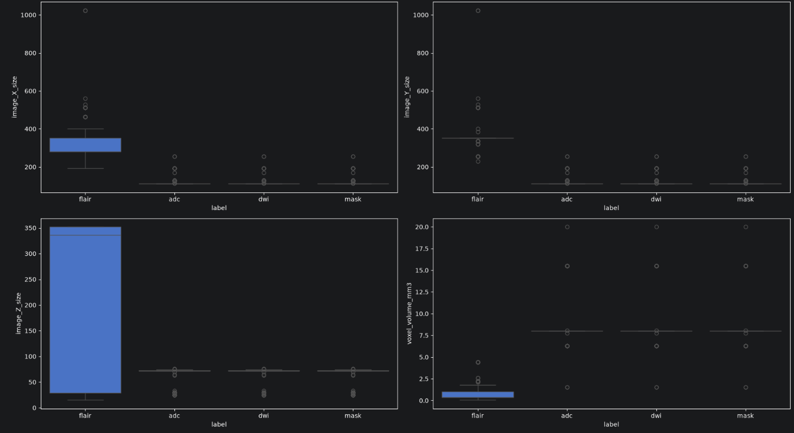
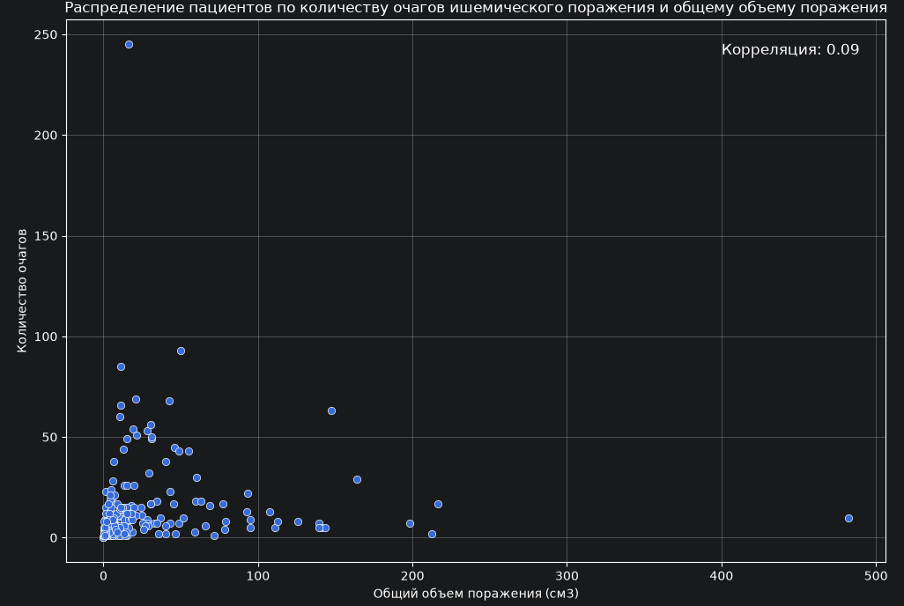
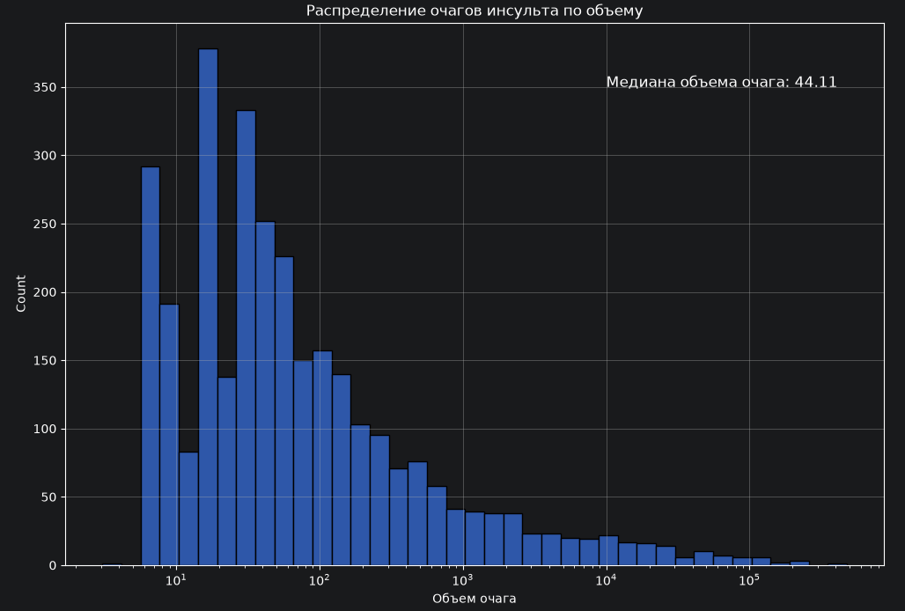
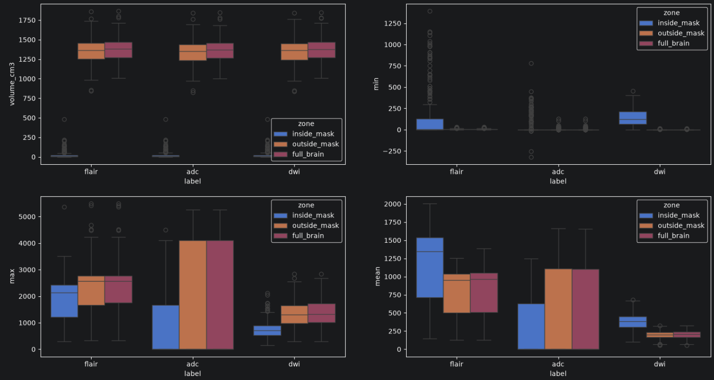
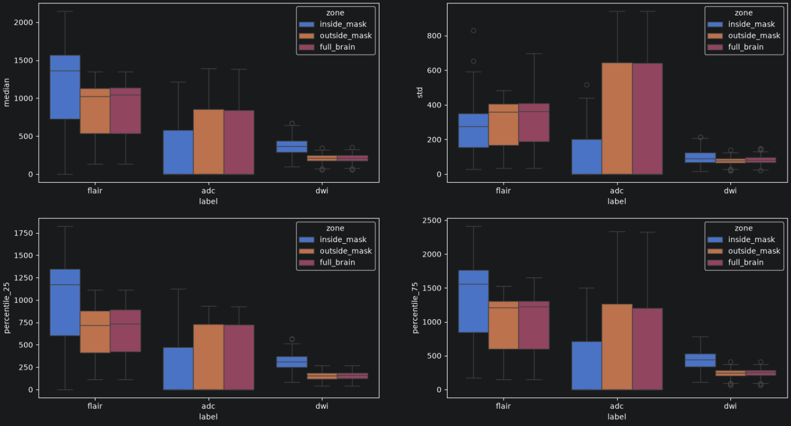
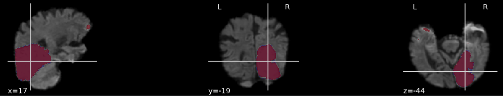
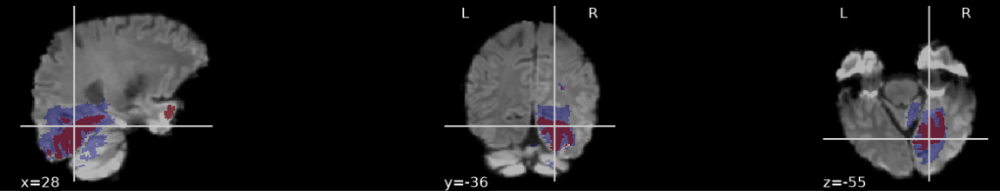

# Сегментация очагов ишемического поражения на МР-снимка мозга

Репозиторий содержит проект, посвященный задаче сегментации очагов ишемического поражения
на МР-снимках головного мозга. В проекте реализовано сравнение четырех моделей сегментации объектов.

### Цель проекта

Разработать модель для качественной сегментации очагов ишемического инсульта разного объема и количества на острой 
и подострой стадии и провести детальный анализ ее работы на разных подгруппах пациентов.
Желаемый результат: модель, достигающая Dice > 0.7 для крупных очагов ишемии и Dice > 0.3 для мелких очагов ишемии.


### Мотивация к реализации

Во время обучения в бакалавриате и магистратуре я занимался МР-визуализацией ишемического 
инсульта. Значительная часть работы заключалась в ручной сегментации ишемических поражений,
что является достаточно монотонной и скучной работой. Поэтому я решил реализовать модель, 
которая смогла бы с высоким качеством сегментировать очаги ишемического поражения и была
бы очень полезна в прошлом.

### Актуальность проекта

С увеличением скорости МР-диагностики, растет доля назначений МР-визуализации ишемического 
поражения на ранних стадиях инсульта, в том числе и для первичной диагностики [1, 2], в том 
числе по причине большей информативности МР-снимков, по сравнению с КТ, которая позволяет 
врачам лучше планировать лечение [3]. По этой причине все большую актуальность набирают
методы автоматической сегментации ишемического поражения на ранних сроках, которые позволили
бы врачам быстрее анализировать МР-снимки.

---

##  Стек технологий

* **Язык**: Python 3.10+
* **Глубокое обучение**: PyTorch, MONAI.networks
* **Трансформация и аугментация данных**: MONAI.transforms
* **Регистрация изображений**: SimpleITK
* **Валидация и метрики**: SciPy, MedPy, MONAI.losses
* **Инструменты и анализ**: NiBabel, Pandas, NumPy, Scikit-learn
* **Визуализация**: Nilearn, Matplotlib, Seaborn

---

## Структура репозитория

```text
├── src/                            # Исходный код проекта (Модули)
│   ├── data_utils.py               # Функции загрузки данных, выделения групп пациентов
│   ├── image_analysis.py           # Функции анализа метаданных и интенсивности изображений  
│   ├── lesion_analysis.py          # Функции анализа масок исходной сегментации
│   ├── visualization.py            # Функции визуализации МР-изображений с наложением масок 
│   ├── preprocessing.py            # Разбиение на подвыборки, трансформация и аугментация данных, формирование лоадеров
│   ├── get_model.py                # Инициализации моделей (U-Net, Attention U-Net, U-Net ++, Swin UNETR)
│   ├── train_model.py              # Функция обучения и валидации модели
│   └── evaluate_model.py           # Функции поиска оптимального порога уверенности и расчета метрик 
├── weights/                        # Директория для сохранения весов моделей
├── visual_reports/                 # Директория для сохранения изображений для отчета
├── .gitignore                      # Исключение тяжелых весов и датасета из контроля версий
├── EDA.ipynb                       # Ноутбук с анализом изображений и масок сегментации
├── register_flair.ipynb            # Ноутбук с регистрацией FLAIR снимков к DWI
├── model_exploration.ipynb         # Ноутбук c обучением всех моделей с сохранением лучших весов
├── model_refinement.ipynb          # Ноутбук c доработкой итоговой модели
├── ensemble_model.ipynb            # Ноутбук c обучением моделей для ансамбля моделей
├── DATA_LICENSE.txt                # Текстовый документ с информацией о лицензии на данные
├── requirements.txt                # Список зависимостей для развертывания проекта
└── README.md                       # Документация проекта
```

---
## Источник данных и лицензия

В работе используется датасет ISLES 2022, содержащий МР-изображения головного мозга и маски сегментации 
ишемического поражения. Среди МР-изображений представлены протоколы: FLAIR, DWI, ADC

Датасет распространяется под лицензией **MIT License**. 

* **Оригинальный репозиторий датасета**: [ISLES 2022](https://zenodo.org/records/7960856)
* **Авторы датасета**: Hernandez Petzsche, de la Rosa, Ezequiel, et al. Полные ссылки на 
авторство указаны в источниках [4, 5, 6].
* **Условия использования**: Разрешается использование данных в коммерческих и некоммерческих целях 
при условии указания авторства и без права распространения самих данных без письменного согласия авторов. 
Соответствующий файл лицензии сохранен в корне проекта.

---

## Использованное оборудование

* GPU: NVIDIA GeForce RTX 4050
* RAM: 16 GB
* Память: 6 GB (с учетом данных, установки библиотек и весов моделей)

##  Установка и запуск

1. Клонируйте репозиторий:
   ```bash
   git clone https://github.com/vladschwartz99-cmd/Stroke_segmentation.git
   ```
   
2. Перейдите в директорию проекта:
   ```bash
   cd portfolio/Stroke_segmentation
   ```
   
3. Установите зависимости:
   ```bash
   pip install -r requirements.txt
   ```
   
4. Организация окружения:
   ```bash
    pip install jupyter nbconvert ipykernel
    python -m ipykernel install --user --name recommender --display-name "Python (segmentation)"
   ```

5. Запустите ноутбуки:
   ```bash
   jupyter nbconvert --execute --inplace EDA.ipynb
   jupyter nbconvert --execute --inplace register_flair.ipynb
   jupyter nbconvert --execute --inplace model_exploration.ipynb # (модели тренируются около недели на RTX 4050)
   jupyter nbconvert --execute --inplace model_refinement.ipynb # (модели тренируются около 2 дней на RTX 4050)
   jupyter nbconvert --execute --inplace ensemble_model.ipynb # (модели тренируются около 2 дней на RTX 4050)
   ```
   
---

## Исследовательский анализ данных (EDA)

### Анализ метаданных МР-изображений и масок сегментации

Распределение размеров и объема вокселя МР-изображений и масок сегментации:
<p align="center">
  
</p>

При анализе метаданных снимков и масок обнаруживается, что:
1. Все снимки и маски трехмерные. 
2. Размер изображений по осям у ADC, DWI и масок варьируется для осей X и Y от 112 до 256 вокселей, для оси Z от 25 
до 76 вокселей, а объем вокселя от 1.53 до 20 мм³. Медианы этих параметров составляют: 112 вокселей для осей X и Y;
72 вокселей для оси Z и 8 мм³ для объема вокселя.  Также стоит отметить, что все эти распределения одинаковы у всех
этих групп, что говорит о том, что маски строились на основании ADC или DWI. 
3. FLAIR снимки, в сравнении с другими, более вариативны по размерам по осям и объемам вокселей. Размер по оси X 
варьируется от 192 до 1024 вокселей, по оси Y - от 230 до 1024 вокселей, для оси Z - от 15 до 352 вокселей, 
а объем вокселя от 0.05 до 4.43 мм³. Медианы этих параметров составляют: 281 воксель для оси X; 352 вокселя для 
оси Y; 336 вокселей для оси Z и 0.36 мм³ для объема вокселя. 
4. Прослеживается логичная закономерность: FLAIR снимки в среднем более протяженные по осям, но физический объем 
их вокселей в среднем меньше. 
5. Изображения и маски обладают большим разнообразием матриц преобразования. Насчитывается 497 уникальных матриц 
преобразования. 
6. Типы данных также различаются. Среди типов данных МР-изображений встречаются int и float, а для масок 
сегментации - int, float и uint8.

Такая разнородность изображений и масок по своим основным характеристиками, вероятно, говорит о том, что данный 
датасет был сформирован путем сбора снимков от разных учреждений/томографов, характеристики съемок между которыми 
не согласованы.


### Анализ масок сегментации

В процессе анализа масок сегментации было установлено, что все маски являются бинарными.

Был проведен анализ отдельных очагов ишемии, который осуществлялся посредством выделения отдельных очагов из 
маски сегментации методом связных компонент. Также была проведена попытка удаления возможного шума из исходной 
сегментации посредством морфологического открытия масок сегментации, что привело к удалению из маски очагов очень 
малого объема, локализующихся в стволе головного мозга, которые не могут рассматриваться как шум, из-за чего было 
решено отказаться от морфологического открытия масок и рассматривать все компоненты присутствующие в исходных 
сегментациях.

На основании всей сегментации анализировался общий объем поражения у пациента, а на основе отдельных очагов 
рассматривались количество очагов ишемии у пациента и объем отдельных очагов.

<p align="center">
  
</p>

Общий объем ишемического поражения у большинства пациентов составляет от 0 до 50 см³, также имеется небольшое число 
пациентов с объемом поражения от 50 до 220 см³ и один пациент с очень обширным поражением, объем которого близок к 
500 см³. 

У большинства пациентов поражение представлено 1-15 очагами, у меньшего количества пациентов наблюдается от 15 до 
100 очагов и у одного пациента - 250 очагов. Также имеется несколько пациентов без очагов, то есть с пустыми масками 
сегментаций. 

Корреляция между общим объемом поражения и количеством очагов составляет 0.09, что говорит о том, что взаимосвязь 
между количеством очагов и общим объемом поражения не прослеживается, а в датасете представлены случаи инсульта 
разного генеза, так как эти характеристики зависят от причины, локализации, степени окклюзии и других признаков.

<p align="center">
  
</p>

Рассмотрение объема отдельных ишемических очагов показало, что объем большинства очагов инсульта не превышает 
200 мм³, некоторые очаги инсульта имеют объем от 200 мм³ до 100 см³ и единичные очаги по своему объему превышают 
100 см³. Медианный объем очага инсульта составляет 44.11 мм³.

### Анализ интенсивности МР-изображений

Распределение статистических характеристик интенсивности изображений внутри ишемических очагов, за их пределами 
и во всем мозге:
<p align="center">
  
</p>
<p align="center">
  
</p>

Исходя из проведенного анализа можно сказать, что:
1. В данных прослеживается заметный дисбаланс классов. Объемы поражений составляют малую часть общего объема мозга. 
2. Отрицательные значения минимума интенсивности в поражении на ADC, вероятно, говорят о присутствии шума в 
изображениях. 
3. На DWI изображениях характеристики распределения интенсивности в целом показывают меньшую вариативность внутри 
поражения, за его пределами и во всем мозге, в сравнении с ADC и FLAIR. 
4. Заметное перекрытие распределений характеристик во всех областях на всех протоколах, вероятно, говорит о том, 
что в датасете представлено большое количество случаев ишемического инсульта небольшой силы, что согласуется с 
анализом масок сегментаций. 
5. Более высокие минимальные и средние значения интенсивности на DWI и FLAIR и более низкие максимальные и средние 
значения на ADC согласуются с логикой визуализации ишемического инсульта на данных протоколах. 
6. На DWI изображениях распределение характеристик внутри поражения заметнее отличается (по сравнению с ADC и FLAIR) 
от области за пределом поражения в сторону более высоких средних значений и перцентилей распределения (как и должно 
быть для DWI изображений), что говорит о том, что на DWI лучше визуализируется контраст ишемического поражения и 
здоровой ткани.

### Примеры МР-снимков для визуального отражения разнообразия датасета

Пример крупного ишемического поражения, локализующегося в полушариях:
<p align="center">
  
</p>

Пример ишемического поражения небольшого объема, локализующегося в стволе мозга (он плохо визуализируется из-за 
небольших размеров; локализируется на пересечении осей):
<p align="center">
  
</p>

---

## Разбиение данных на подвыборки

Разбиение данных производилось со стратификацией по пациенту, количеству и размерам очагов поражения. 
Стратификация по пациентам была необходима в связи с тем, что для каждого пациента имеется по 3 МР-изображения
разных протоколов, и нельзя было допустить распространение снимков одного пациента по разным подвыборкам во 
избежание утечки данных. 

Для стратификации по количеству и размерам очагов, признак количества очагов был разделен на единый очаг и 
множественные очаги, а признак размера очагов был раздел на крупные и мелкие очаги по медиане объема очагов 
в данном датасете (а не по медицинской границе объема, так как из-за особенности датасета большинство очагов
классифицировались как мелкие). Эти признаки были объединены в единый признак, на основе которого пациенты 
разделились на 5 групп:

| Группа пациентов                      | Количество пациентов |
|:--------------------------------------|:--------------------:|
| Множественные очаги смешанного объема |         167          |
| Один крупный очаг                     |          42          |
| Множественные только крупные очаги    |          36          |
| Без поражения                         |          3           |
| Множественные только мелкие очаги     |          2           |

Пациенты разделены на группы по размеру и количеству очагов поражения неравномерно. Больше всего пациентов 
представлено в группе множественных очагов смешанного объема, составляя 67% от общего числа пациентов. 
Пациенты с одним очагом небольшого объема отсутствую, а пациенты с одним крупным очагом составляют 17% 
от общего числа пациентов. Учитывая, что порог разделения крупных и мелких очагов производился по медиане 
данного датасета, а не по клинической границе, это говорит о том, что данный датасет сильно смещен в 
сторону случаев инсульта эмболического генеза, так как, согласно статистике, случаи инсульта, 
представленные одним очагом составляют 45-50% от всех случаев инсульта [7]. Также в датасете представлено 
3 пациента без ишемического поражения.

---

## Предобработка изображений

Для всех изображений производились следующие трансформации:
* Приведение к единому пространственному положению.
* Приведение к единому объему вокселя.
* Удаление фона.
* Нормализация, с отсеиванием экстремальных значений для подавления шума.
* Объединение протоколов в одно многоканальное изображение.
* Патчинг изображения для тренировочных данных производился с повышенной репрезентацией очагов для борьбы с 
дисбалансом классов, а для валидационных и тестовых данных - равномерный по всему изображению с перекрытием 
* в 50%.

Для тренировочных данных также производились аугментации:
* Случайный поворот в пределах 15 градусов по всем осям
* Отражение по осям X, Y и Z. Так как при патчинге модель не сможет опираться на общую анатомию мозга, 
отражения по всем осям допустимы
* Добавление гаусового шума, для борьбы с переобучением
* Изменение контрастности, так как степень изменения интенсивности в очаге инсульта зависит от большого 
количества факторов и может быть разной у случаев инсульта схожего генеза

При формировании многоканального изображения было обнаружено, что FLAIR снимки накладываются на DWI и ADC
некорректно, на основании чего было обнаружено, что FLAIR снимки не регистрировались к остальным снимкам, 
что потребовало самостоятельной регистрации для формирования верного многоканального изображения при помощи
SimpleITK

---

## Исследуемые архитектуры моделей

Были выбраны четыре архитектуры сегментации изображений для определения наиболее 
эффективной для данной задачи:

1. **3D U-Net**: Используется, как базовая модель сегментации 3D изображений.
2. **3D Attention U-Net**: Ожидается более высокая точность на очагах малого объема, за счет механизма внимания.
3. **3D U-Net ++**: Ожидаются более высокие: соответствие границ сегментации и очага; точность на очагах малого 
объема за счет плотных вложенных связей.
4. **Swin UNETR**: Ожидается более высокая точность на очагах малого объема, а также интересно посмотреть, как 
с этой задачей справится трансформер.


## Наборы протоколов, выбранные для проведения экспериментов

* DWI + ADC

Так как ADC является производным от DWI и несет дополнительные, согласованные с DWI, признаки, то использование 
этих протоколов в совокупности, потенциально дает, обученной на них модели, лучшее качество в сравнении с 
моделями, обученными только на ADC или DWI.

* DWI + ADC + FLAIR

Обучение модели исключительно на FLAIR не представляется рациональным для сегментации очага инсульта на острой 
и подострой стадиях по причине того, что на FLAIR визуализируются зона пенумбры и очаги хронического инсульта. 
По этой причине данный протокол будет добавлен к ADC и DWI для оценки того, несет ли FLAIR дополнительные 
полезные признаки для данной задачи.

---

## Обучение моделей

Все модели обучались в течении 200 эпох, с механизмом ранней остановки на основе метрики soft Dice 
валидационной выборки.

В качестве функции потерь был выбран DiceFocalLoss за счет чувствительности к небольшим объектам на изображении.

В качестве оптимизатора был выбран AdanW, так как он лучше борется с переобучением, чем классический Adam.

В качестве планировщика скорости обучения был выбран ReduceLROnPlateau, отслеживая коэффициент Дайса на 
валидационной выборке.

Из-за нехватки вычислительных ресурсов для передачи моделям батча из более чем 2 изображений, был реализован
механизм градиентного накопления

---

## Методы оценки моделей

Для изображений подсчитывались глобальные метрики Recall, Precision, F1, Dice, IoU, HD, корреляция Спирмена
для объемов очагов. После чего, на основе метрики Dice выбирался оптимальный порог уверенности модели.

С выбранным порогом подсчитывались Dice, IoU, HD по группам пациентов для каждого очага инсульта по 
отдельности, после чего подсчитывались средние метрики по группам пациентов и очагам разных размеров

Проводилось визуальное сравнение исходной и предсказанной масок для случаев лучшей и худшей сегментации,
основываясь на метрике Dice для конкретного пациента

---

## Сравнение моделей и наборов протоколов для обучения:


| Набор протоколов  |       Модель       | Global_recall | Global_precision | Global_F1  | Global_dice | Big_lesion_dice | Small_lesion_dice |  Global_HD  | Global_spearman_coef |
|:------------------|:------------------:|:-------------:|:----------------:|:----------:|:-----------:|:---------------:|:-----------------:|:-----------:|:--------------------:|
| DWI + ADC         |      3D U-Net      |     0.81      |       0.78       |    0.79    |    0.59     |      0.56       |      0.0001       |    26.86    |         0.86         |
| DWI + ADC         | 3D Attention U-Net |     0.73      |       0.70       |    0.72    |    0.50     |      0.58       |       0.10        |    44.04    |         0.67         |
| DWI + ADC         |     3D U-Net++     |     0.88      |       0.85       |    0.87    |    0.64     |      0.64       |       0.17        |    32.62    |         0.86         |
| DWI + ADC         |     Swin UNETR     |     0.85      |       0.81       |    0.83    |    0.63     |      0.64       |       0.18        |    28.72    |         0.78         |
| DWI + ADC + FLAIR |      3D U-Net      |     0.85      |       0.88       |    0.86    |    0.61     |      0.56       |         0         | **_20.80_** |         0.94         |
| DWI + ADC + FLAIR | 3D Attention U-Net |     0.88      |       0.85       |    0.87    |    0.60     |      0.57       |    **_0.21_**     |    38.40    |         0.79         |
| DWI + ADC + FLAIR |     3D U-Net++     |  **_0.92_**   |    **_0.89_**    | **_0.90_** | **_0.67_**  |   **_0.67_**    |       0.15        |    29.96    |      **_0.95_**      |
| DWI + ADC + FLAIR |     Swin UNETR     |     0.85      |       0.81       |    0.83    |    0.59     |      0.63       |       0.16        |    37.86    |         0.95         |
_Примечание: В данной таблице значения метрик округлены до 2 знаков после запятой, но выделение лучших метрик
производилось на основании полных значений метрик_


Использование протокола FLAIR для обучения:
* для всех моделей улучшает способность обнаруживать ишемическое поражение, снижает генерацию ложных очагов, улучшает 
оценку объема поражения;
* для всех моделей, кроме Swin UNETR повышает качество общей сегментации всего поражения и крупных ишемических очагов, 
а также качество сегментации границ поражения;
* для всех моделей, кроме 3D Attention U-Net, снижает качество сегментации очагов малого объема.

Сравнение моделей:
* 3D U-Net показывает удовлетворительные метрики сегментации крупных очагов ишемического инсульта и наилучшее качество
сегментации границ поражения, однако также и неспособность производить сегментацию мелких очагов
* 3D Attention U-Net показывает худшее качество, по сравнению со всеми остальными моделями, по всем показателям, кроме
качества сегментации ишемических очагов малого объема, превосходя по этому показателю все остальные модели
* 3D U-Net++ показывает лучшие метрики полноты, точности, оценки объема поражения и качества общей сегментации и 
сегментации крупных ишемических очагов, показывая, что среди всех исследованных моделей, она лучше всего справляется 
с поставленной задачей
* Swin UNETR по общему качеству занимает второе место при обучении на DWI и ADC, и уступает другим моделям при 
добавлении протокола FLAIR. Вероятно, даже при условии использования предобученных весов и аугментации изображений, 
размер датасета оказался недостаточным для ее качественного обучения

Также производилось визуальное сравнение исходных и сгенерированных масок для лучших и худших случаев сегментации
каждой модели. Результаты этих сравнений согласуются с наблюдениями, полученными на основе метрик.

---

## Методы доработки выбранной модели

Основной задачей доработки модели, было поставлено повышение качества сегментации очагов малого объема без значимого
снижения остальных параметров модели, или, что желательно, с их улучшением. Для доработки модели были опробованы 
следующие методы:
* Увеличение ширины каналов сети
* Увеличение градиентного накопления
* Замена функции потерь на более чувствительную к мелким очагам с высоким штрафом за пропуск вокселей
* Добавление к сети механизма deep supervision

|                     Модель                      | Global_recall | Global_precision | Global_F1  | Global_dice | Big_lesion_dice | Small_lesion_dice |  Global_HD   | Global_spearman_coef |
|:-----------------------------------------------:|:-------------:|:----------------:|:----------:|:-----------:|:---------------:|:-----------------:|:------------:|:--------------------:|
|                Исходная U-Net++                 |  **_0.92_**   |    **_0.89_**    | **_0.91_** | **_0.67_**  |   **_0.67_**    |    **_0.16_**     |    29.96     |         0.95         |
|      U-Net++ с увеличенной шириной каналов      |     0.88      |       0.85       |    0.87    |    0.62     |      0.63       |       0.14        | **_29.13_**  |         0.92         |
|  U-Net++ с увеличенным градиентным накоплением  |  **_0.92_**   |    **_0.89_**    | **_0.91_** |    0.65     |      0.67       |       0.15        |    26.79     |         0.94         |
|             U-Net++ c Tversky Loss              |     0.88      |       0.85       |    0.85    |    0.62     |      0.63       |       0.13        |    36.08     |      **_0.97_**      |
|           U-Net++ c deep supervision            |     0.88      |       0.85       |    0.85    |    0.61     |      0.63       |       0.16        |    30.41     |         0.94         |


Все способы доработки показывают модели худшего общего качества, по сравнению с исходной моделью. Модель с 
увеличенной шириной каналов превосходит исходную по дистанции Хаусдорфа, а модель, обученная с Tversky loss - 
по значению коэффициенту корреляции Спирмена. Однако исходная модель сохраняет лидерство по значениям метрик recall, 
precision, F1, dice для всего снимка, dice для крупных и мелких очагов среди всех рассмотренных моделей.

---

## Ансамблирование моделей

На основе попыток улучшения модели было принято решение сформировать ансамбль из 2 моделей U-Net++, в котором одна 
модель будет обучена сегментировать крупные ишемические очаги, а другая - мелкие. 

Для этого маски исходной сегментации были разделены на маски отдельно только крупных и только мелких очагов по 
порогу размера очага равному 44 мм³, который ранее был определен, как медиана объема очага данного датасета.

Модель сегментации очагов крупного размера обучалась с использованием функции потерь Dice CE loss для лучшего 
качества сегментации крупных объектов на изображении и при обучении получала маски только крупных очагов. 
Модель сегментации очагов мелкого размера обучалась с использованием функции потерь Tversky Focal loss для 
лучшего обнаружения и качества сегментации очень мелких объектов на изображении и при обучении получала маски 
только мелких очагов. Для обеих моделей при обучении использовались: оптимизатор AdamW; планировщик Reduce LR 
On Plateau; ранняя остановка на основе Dice валидационной выборки; градиентное накопление для обхода нехватки 
вычислительных ресурсов.

При инференсе обе модели получают одинаковое изображение, на основе которого модели формируют отдельные 
вероятностные карты принадлежности вокселей к ишемическому поражению. Затем происходит объединение вероятностных 
карт в одну с присвоением каждому вокселю максимального значения из этих 2 вероятностных карт, после чего итоговая 
вероятностная карта бинаризируется на основе оптимального порога уверенности, равного 0,85.

---

## Результаты

Сравнение метрик ансамбля моделей с исходной U-Net++:

|                     | Исходная U-Net++ | Ансамбль моделей | Разница метрик |
|:-------------------:|:----------------:|:----------------:|:--------------:|
|       Recall        |      0.9231      |      0.9615      | **_+0.0384_**  |
|      Precision      |      0.8889      |      0.9259      | **_+0.0370_**  |
|         F1          |      0.9057      |      0.9434      | **_+0.0377_**  |
|        Dice         |      0.6677      |      0.6449      |    -0.0228     |
| Dice крупных очагов |      0.6674      |      0.6561      |    -0.0113     |
| Dice мелких очагов  |      0.1617      |      0.3595      | **_+0.1978_**  |
|         HD          |     29.9601      |     31.3486      |    +1.3885     |
|    Spearman_coef    |      0.9542      |      0.9554      | **_+0.0012_**  |

По сравнению с одной U-Net++, ансамбль из 2 моделей показывает лучшие значения метрик recall, precision, F1, 
корреляции Спирмена и, особенно заметно, dice для мелких очагов. Ансамбль немного уступает одной U-Net++ по 
значения метрик dice для всего снимка, dice для крупных очагов и дистанции Хаусдорфа.

Итоговые метрики качества ансамбля моделей, обученных на DWI, ADC и FLAIR снимках на уровне целых снимков:

| Recall | Precision |  F1  | Spearman_coef | Dice | IoU  |  HD   |
|:------:|:---------:|:----:|:-------------:|:----:|:----:|:-----:|
|  0.96  |   0.92    | 0.94 |     0.96      | 0.64 | 0.52 | 31.35 |

Модель показывает высокое качество обнаружения ишемического поражения у пациентов и умеренное качество сегментации 
самого поражения, имея проблемы с генерацией ложных очагов небольшого размера.

Метрики сегментации для очагов разного размера:

|                                  | Dice | IoU  |  HD  |
|:---------------------------------|:----:|:----:|:----:|
| Метрика для очагов всех размеров | 0.62 | 0.49 | 8.72 |
| Метрика для крупных очагов       | 0.66 | 0.53 | 9.61 |
| Метрика для мелких очагов        | 0.36 | 0.26 | 3.00 |

Модель показывает умеренное качество сегментации очагов крупного объема и низкое - мелких очагов (меньше 44 мм3)

Метрики по группам пациентов:

| Группа пациентов                      | Кол-во пациентов в test | Recall | Precision |  F1  | Dice | IoU  |  HD   | Spearman_coef |
|:--------------------------------------|:-----------------------:|:------:|:---------:|:----:|:----:|:----:|:-----:|:-------------:|
| Множественные очаги смешенного объема |           17            |  1.00  |   1.00    | 1.00 | 0.60 | 0.46 | 9.03  |     0.94      |
| Один крупный очаг                     |            4            |  1.00  |   1.00    | 1.00 | 0.66 | 0.55 | 16.94 |     0.80      |
| Множественные только крупные очаги    |            4            |  1.00  |   1.00    | 1.00 | 0.78 | 0.66 | 0.75  |     1.00      |
| Без поражения                         |            1            |  0.00  |   0.00    | 0.00 | 0.00 | 0.00 | 0.00  |       -       |
| Множественные только мелкие очаги     |            1            |  0.00  |   0.00    | 0.00 | 0.28 | 0.18 | 2.44  |       -       |


Данное рассмотрение показывает, что ансамбль показывает лучшее качество сегментации поражения и оценки его объема 
для пациентов со множественными крупными очагами. Precision, Recall и F1 одинаково высоки для групп пациентов, 
у которых присутствуют крупные очаги

Матрица ошибок на уровне пациента (с учетом перекрытия исходной и предсказанной сегментаций более чем на 15%):

| Группа пациентов                      | 	tp | fp | fn | tn |
|:--------------------------------------|:---:|:--:|:--:|:--:|
| Множественные очаги смешенного объема | 	17 | 0  | 0  | 0  |
| Множественные только крупные очаги    |  4  | 0  | 0  | 0  |
| Один крупный очаг                     | 	4  | 0  | 0  | 0  |
| Без поражения                         | 	0  | 1  | 0  | 0  |
| Множественные только мелкие очаги     | 	0  | 1  | 1  | 0  |

Матрица показывает, что модель хорошо обнаруживает факт поражения у пациента. При рассмотрении подобной матрицы без 
порога перекрытия сегментаций, обнаруживается, что в случае множественных только мелких очагов ошибки возникают из-за
низкой степени пересечения. Обнаруживается также, что модель производит сегментацию пациенту без поражения, однако тот
факт, что он только 1 не дает полноценно судить об этом явлении

Precision, recall и f1 на уровне очагов (с учетом перекрытия исходной и предсказанной сегментаций более чем на 15%):

| Группа пациентов                      |  f1   | precision | recall |
|:--------------------------------------|:-----:|:---------:|:------:|
| Множественные очаги смешенного объема | 	0.39 |   0.32    |  0.53  |
| Множественные только крупные очаги    | 0.31  |   0.20    |  0.71  |
| Один крупный очаг                     | 	0.16 |   0.09    |  1.0   |
| Без поражения                         |   0   |     0     |   0    |
| Множественные только мелкие очаги     | 	0.08 |   0.05    |  0.5   |

Данные метрики показывает, что модель обладает достаточно высокой способностью обнаруживать очаги крупного объема 
и умеренной - очаги мелкого объема. При этом модели свойственно генерировать много ложных очагов или дробить один 
истинный очаг на несколько отдельных

### Примеры работы ансамбля моделей

Пример хорошей сегментации (синее - исходная сегментация; красное - предсказанная сегментация):
<p align="center">
  
</p>

Пример плохой сегментации (синее - исходная сегментация; красное - предсказанная сегментация):
<p align="center">
  
</p>

---

## Заключение

В процессе данной работы были опробованы 4 архитектуры нейросетей для сегментации очагов ишемического инсульта на 
МР-снимках датасета ISLES 2022. Была определена лучшая, среди этих 4, архитектура и проведены попытки улучшения 
ее качества. После чего был реализован ансамбль моделей сегментации очагов разного размера.

Ансамбль моделей показывает:
* высокое качество обнаружения ишемического поражения у пациентов;
* высокое качество оценки объема поражения;
* умеренное качество сегментации очагов крупного и малого объема;
* склонность генерировать ложные очаги малого объема и делить единые очаги на несколько более мелких.


Поставленная цель по разработке модели для качественной сегментации очагов ишемического инсульта выполнена. 
Желаемый результат получен частично: модель превышает установленный порог по качеству сегментации очагов малого 
объема и не достигает порога для крупных очагов

---

## Возможные улучшения

1. Формирование большего датасета для обучения и тестирования моделей, которое потребует объединения нескольких 
датасетов сегментации ишемического инсульта
2. Испытание других архитектур нейросетей сегментации, показывающие высокое качество сегментации медицинских снимков

---

### Источники

1. Costanza Maria Rapillo, Vincent Dunet, Alexander Salerno etc. Moving From CT-First to 
MRI-First Paradigm in Acute Ischemic Stroke: Treatment Rates, Time Metrics, Safety, 
and Outcomes. Journal of Stroke. 2025 Sep;27(3):390-401. doi: 10.5853/jos.2025.02229.

2. Stroke Diagnostic and Therapeutic Market: Global Industry Analysis, Size, Share, Growth, 
Trends, and Forecast 2026–2035 / Towards Healthcare. — Toronto : Towards Healthcare, 2026. 
— 215 p.

3. Bum Joon Kim, Hyun Goo Kang, Hye-Jin Kim etc. Magnetic Resonance Imaging in Acute Ischemic 
Stroke Treatment. Journal of Stroke 2014;16(3):131-145 doi: 10.5853/jos.2014.16.3.131

4. Petzsche, M. R. H., de la Rosa, E., Hanning, U., Wiest, R., Pinilla, W. E. V., Reyes, M., ... 
& Kirschke, J. S. (2022). ISLES 2022: A multi-center magnetic resonance imaging stroke lesion 
segmentation dataset. arXiv preprint arXiv:2206.06694.

5. de la Rosa, Ezequiel, et al. DeepISLES: a clinically validated ischemic stroke segmentation 
model from the ISLES'22 challenge. Nature Communications 16.1 (2025): 7357. 

6. Hernandez Petzsche, Moritz R., et al. ISLES 2022: A multi-center magnetic resonance imaging 
stroke lesion segmentation dataset. Scientific data 9.1 (2022): 762.

7. Ишемический инсульт и транзиторная ишемическая атака у взрослых : клинические рекомендации : 
[утв. Минздравом России в 2024 г. : одобр. Научно-практическим советом Минздрава РФ] / Всероссийское 
общество неврологов, Национальная ассоциация по борьбе с инсультом, Ассоциация нейрохирургов России 
[и др.]. – Москва, 2024. – 191 с. – URL: congress-med.ru (дата обращения: 08.07.2026). – Текст : 
электронный.
